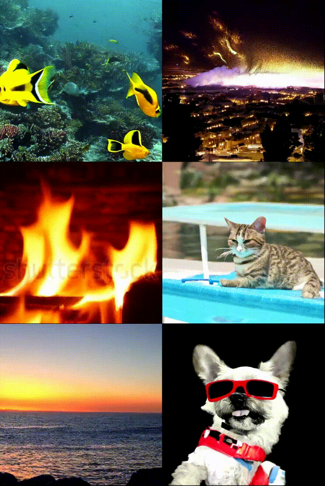

# repro-latte

``Latte``, **a novel latent diffusion transformer for video generation**, utilizes spatio-temporal tokens extracted from input videos and employs a series of Transformer blocks to model the distribution of videos in the latent space. Latte achieves state-of-the-art performance on four standard video generation datasets ``FaceForensics``, ``SkyTimelapse``, ``UCF101``, and ``Taichi-HD``.

## 1. Install helper

**Please check your nvcc version and cuda version >= 11.7**
```bash
nvcc -V
nvidia-smi
```

**environment building**
```bash
# create a new conda environment
conda activate --name latte python=3.9
conda activate latte

# Install the following packages in order
pip install diffusers==0.23.1
pip install einops==0.7.0
pip install timm==0.9.16
pip install torchvision==0.15.2
pip install torch==2.0.1+cu117 --index-url https://download.pytorch.org/whl/cu117
pip install scipy==1.13.0
pip install --no-index torch-scatter -f https://pytorch-geometric.com/whl/torch-2.0.1+cu117.html
pip install --no-index torch-sparse -f https://pytorch-geometric.com/whl/torch-2.0.1+cu117.html
pip install --no-index torch-spline-conv -f https://pytorch-geometric.com/whl/torch-2.0.1+cu117.html
pip install --no-index torch-cluster -f https://pytorch-geometric.com/whl/torch-2.0.1+cu117.html
pip install bs4==0.0.2
pip install ftfy==6.2.0
pip install transformers==4.37.0
pip install xformers==0.0.21
pip install imageio==2.34.0
pip install accelerate==0.24.1
pip install sentencepiece==0.2.0
```

## 2. How to use

### 2.1 Download Pre-trained Files

Download Latte's pre-trained files [here]().

### 2.2 Just try it!

Modify the text prompts in ``example.py`` and then run the following command.

```bash
CUDA_VISIBLE_DEVICES=0 python example.py
```

### 2.3 Reproducibility

